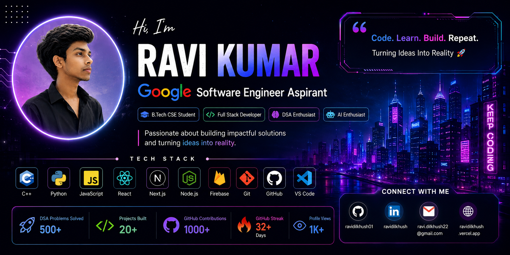

  

<h1 align="center">Hi 👋, I'm Ravi Kumar</h1>
<h3 align="center">🚀 Google Software Engineer Aspirant | Full Stack Developer | AI Enthusiast</h3>

---

# 👨‍💻 About Me

🎓 B.Tech Computer Science Student

🌱 Currently Learning

- Data Structures & Algorithms
- Python
- Next.js
- React
- Firebase
- Artificial Intelligence

💡 Interested In

- Full Stack Development
- Artificial Intelligence
- Competitive Programming
- Open Source

🎯 Goal

Become a Software Engineer at Google.

---

# 🌐 Connect With Me

---

# 🚀 Tech Stack

### Languages

### Frontend

### Backend

### Tools

---

# 📊 GitHub Stats

---

# 🏆 GitHub Trophy

---

# 📈 Contribution Graph

---

# 💻 Featured Projects

⭐ Google SDE AI Mentor

⭐ Portfolio Website

⭐ Weather App

⭐ DSA Repository

⭐ AI Interview Platform

⭐ Notes Management System

---

### ⭐ Thanks for visiting my profile ⭐

